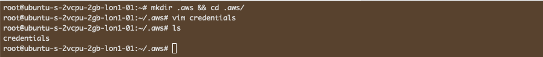

# Ansible Integration in Jenkins

<p float="left">
  

  

</p>

----

## Introduction

I will be integrating Ansible in Jenkins automation server to reliably build, test and deploy a Java-Maven application. Instead of installing the tools inside Jenkins server / container, I will use a different approach. I'll create two dedicated servers in Digital Ocean, one for Jenkins and the one for Ansible. This time I'm doing it remotely as it makes sense from a professional setting, also hey, this is Cloud Computing so I'll take advantage of it.

Once Ansible is set up, I'll execute a playbook from Jenkins Pipeline to configure 2 EC2 instances in AWS by installing Docker and Docker-compose on them. It's good to use multi-cloud technologies and when I get well versed with [**Azure**](https://azure.microsoft.com/en-gb/free/cloud-services/), I will do cross-cloud deployments in both AWS and Azure.

The next thing I'll do is create a pipeline in Jenkins and connect a Java Maven application. Then I'll create a Jenkinsfile that executes Ansible Playbook on the remote Ansible server.

## Ansible Node

I will instantiate a droplet and install **ansible** and Python libraries (**boto3** with **botocore**). I'll also verify that Python3 is installed and if not, install it.

I've made the necessary installations and Ansible server is up and running.


I will also configure AWS credentials to enable connection from Ansible to AWS. I usually have this locally, so I'll create a directory and create the credentials file.



## EC2 Instances

In AWS, I will spin two EC2 instances with t2.micros which will be the **Managed Server Nodes** by the **Ansible Server Node** in Digital Ocean from the Jenkins pipeline.


## Jenkins

I will create a new Jenkins server in Digital Ocean in an Ubuntu (Debian) environment because the other one in AWS has critical projects that I'm working on. I'll install Docker and use it to containerize Jenkins. In a fresh installation, the password is in */var/jenkins_home/secrets/initialAdminPassword* if anyone is using the project. I'll paste mine for demo purposes and because I'll toss the whole server by the time I'll commit and push to GitHub then I'll grab a cuppa as the installations runs the "suggested plugins"..


As usual I'll grab a cuppa as the installations runs the "suggested plugins".


In Jenkins I have installed [SSH Agent](https://plugins.jenkins.io/ssh-agent/) and added SSH key of the Ansible droplet in order to enable connection capabilities. The latest OPENSSH keys are throwing errors in Jenkins, so I converted my key to the old RSA key hash.

```shell
ssh-keygen -p -f ~/.ssh/droplet -m pem -P "" -N ""
```


I have created a similar key for AWS EC2 instance and added it in Jenkins to enable it connect to AWS EC2 instances just the way I added the one of the droplet to enable connection to Digital Ocean.


